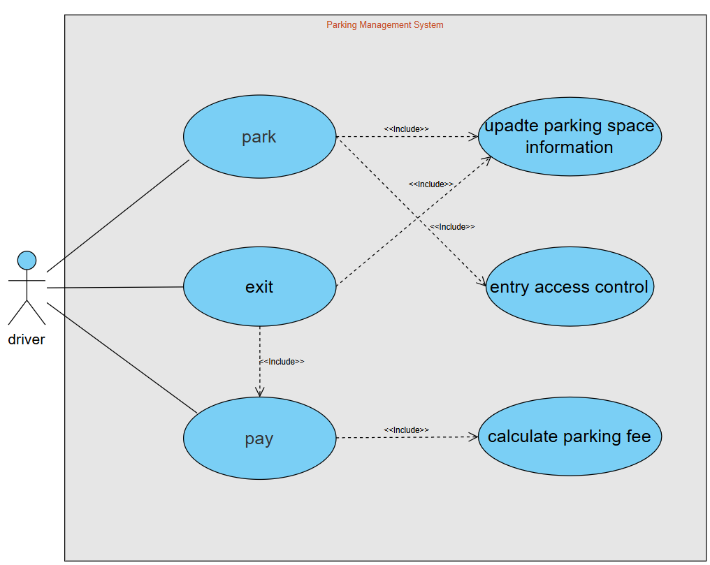
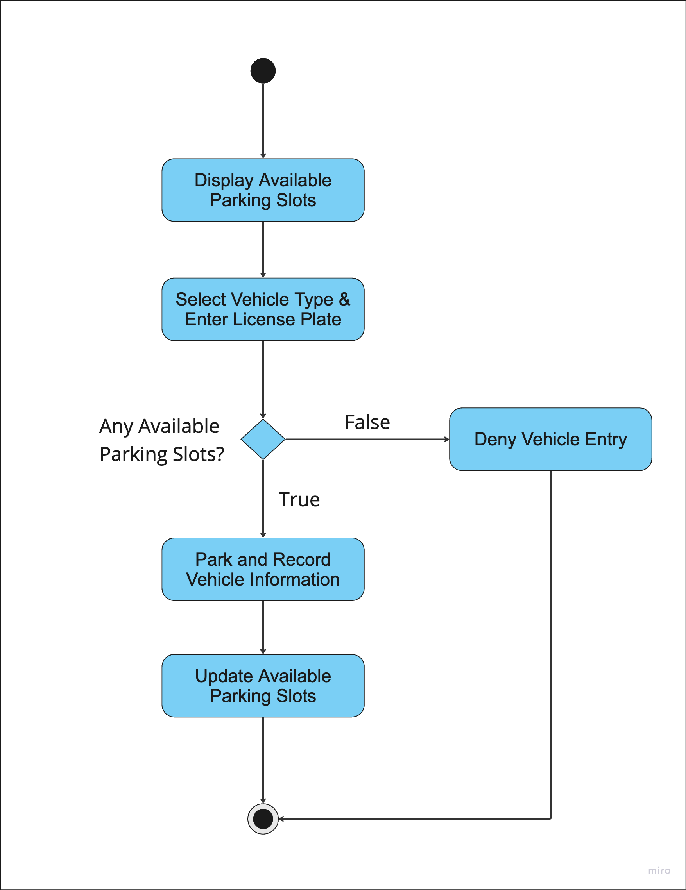
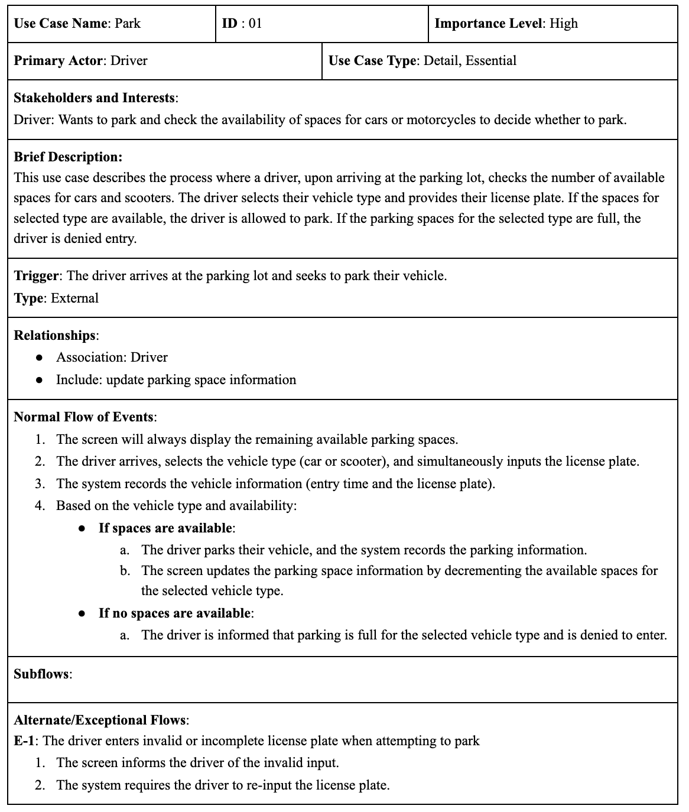
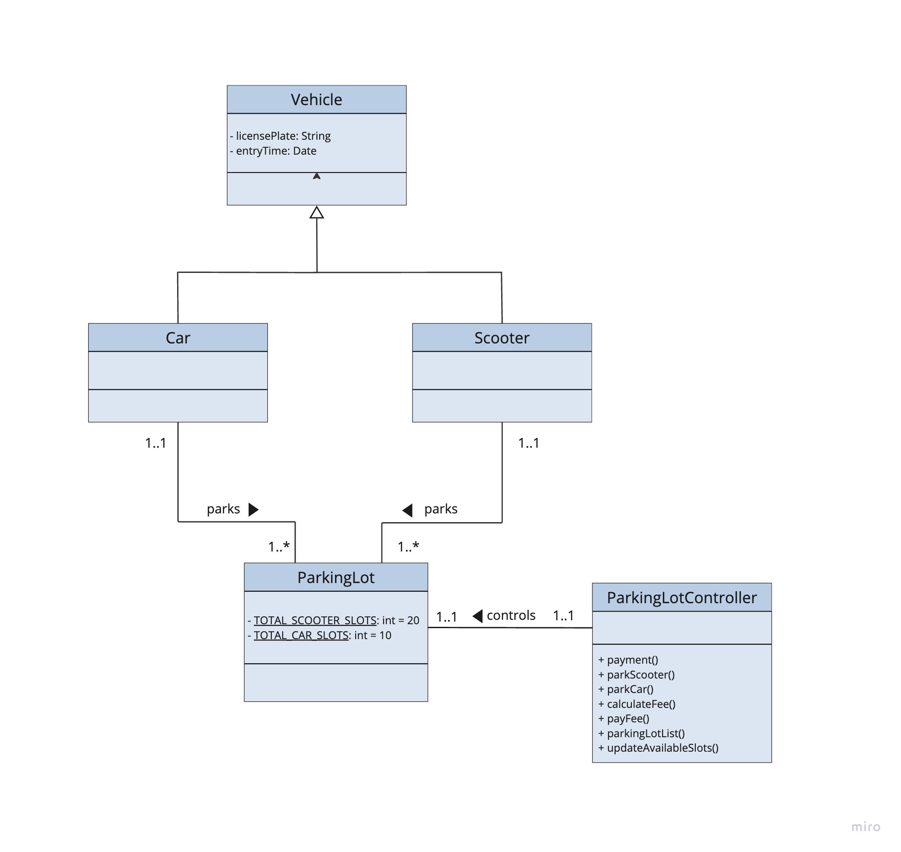
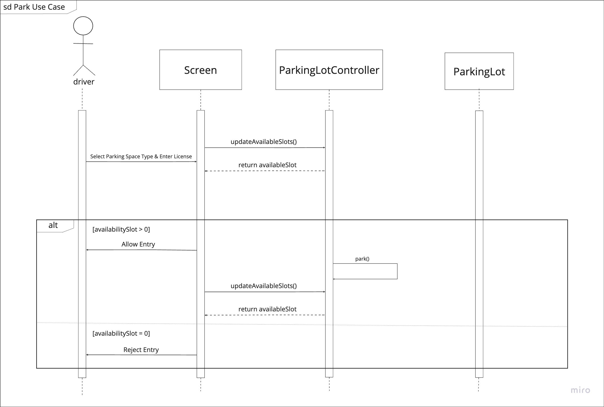

# Parking Management System

The **Parking Management System** is designed to streamline parking operations by managing available parking slots, recording vehicle information, and automatically calculating parking fees. This system aims to provide users with a convenient parking experience.

## 1. System and Features Introduction

This system manages parking operations by providing functionalities such as tracking available slots, recording vehicle details, and calculating fees for user convenience.

### 1.1 System Function Description

| Functionality                                   | Events                               | Trigger                                                                      | Source                                   | Activity                                                                                     | Output                                                     |
| ----------------------------------------------- | ------------------------------------ | ---------------------------------------------------------------------------- | ---------------------------------------- | -------------------------------------------------------------------------------------------- | ---------------------------------------------------------- |
| **Display Available Slots**                     | Display the remaining parking slots  | None (always displayed)                                                      | System (UI display)                      | The system displays the current number of available slots for cars and scooters              | Remaining parking slot numbers are displayed               |
| **Select Vehicle Type and Enter License Plate** | Input vehicle type and license plate | The driver decides to park and selects the type and enters the license plate | Driver                                   | The driver enters the license plate and selects the vehicle type (car or scooter)            | Vehicle type and license plate input received              |
| **Check Parking Availability**                  | Verify parking availability          | The driver submits the vehicle type and license plate                        | System (Parking Lot Controller)          | The system checks the availability of slots for the selected vehicle type                    | Parking available: allow parking; Parking full: deny entry |
| **Allow Parking**                               | Record vehicle entry information     | Parking slots are available and input is valid                               | System (Parking Lot Controller)          | The system records the license plate, vehicle type, and entry time                           | Vehicle information recorded                               |
| **Deny Parking**                                | Deny vehicle entry                   | Parking spaces are full for the selected vehicle type                        | System (Parking Lot Controller)          | The system notifies the driver that parking spaces are full                                  | Notification message displayed                             |
| **Handle Invalid License Plate Input**          | Validate license plate input         | The license plate input is invalid or incomplete                             | System (Parking Lot Controller)          | The system notifies the driver of invalid input and prompts for re-entry                     | Notification message displayed                             |
| **Update Available Slots**                      | Update remaining parking slots       | Vehicle successfully parked or exited the parking lot                        | System (Parking Lot Controller)          | The system updates the number of remaining slots for the corresponding vehicle type          | Updated parking slot number displayed                      |
| **Exit Parking Lot**                            | Record vehicle exit                  | The driver decides to exit the parking lot                                   | Driver & System (Parking Lot Controller) | The system retrieves the recorded vehicle entry time and removes the vehicle record          | Vehicle information removed                                |
| **Calculate Parking Fee**                       | Calculate parking fee                | The driver decides to exit the parking lot                                   | System                                   | The system calculates the parking fee based on the vehicle's entry time and the current time | Parking duration and fee displayed                         |

## 2. Use Case Diagram

### 2.1 Core Use Case

Use Case – **Park**: Describes the user parking process.

## 3. Activity Diagram

## 4. Use Case Description

## 5. Class Diagram

## 6. Sequence Diagram

## 7. State-chart Diagram

This state-chart diagram illustrates the state transitions for `Vehicle` objects in the Parking Management System.

1. **Initial State**: The vehicle has just entered the parking lot and is ready to park.
2. **Entered**: The vehicle has successfully entered the parking lot, and the system has recorded its information.
3. **Payment Complete**: The parking fee has been calculated and paid, and the vehicle is ready to leave the parking lot.
4. **Final State**: The vehicle exits the parking lot.

